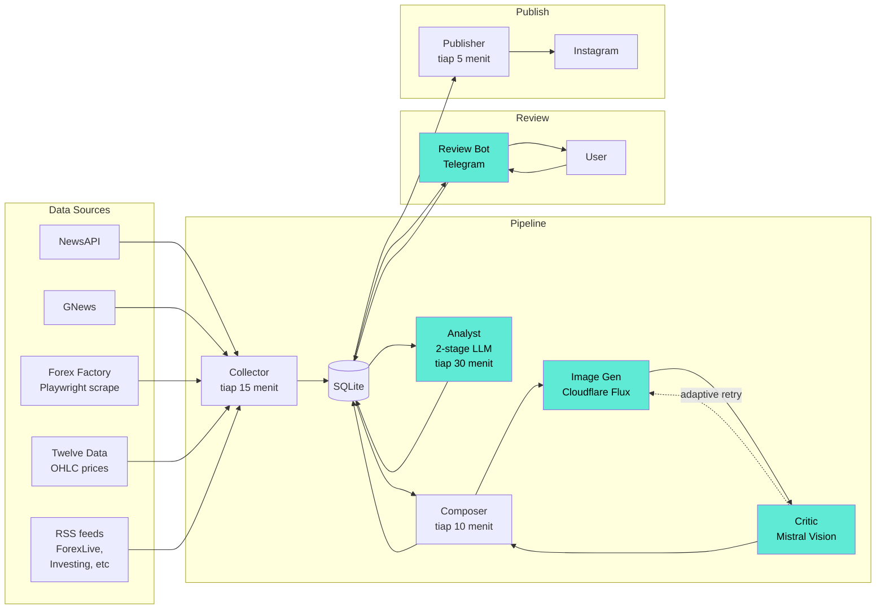
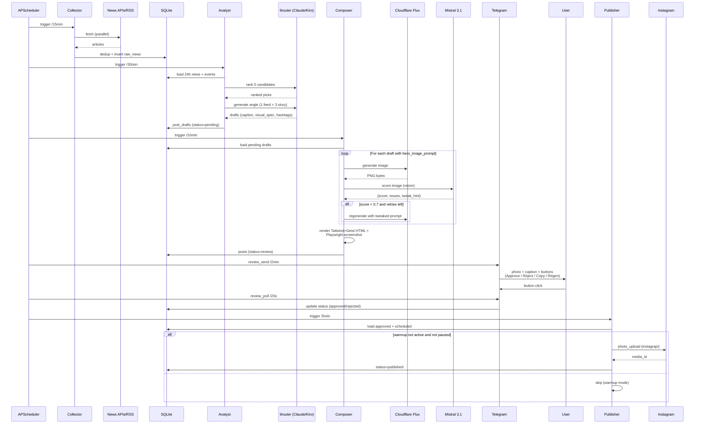
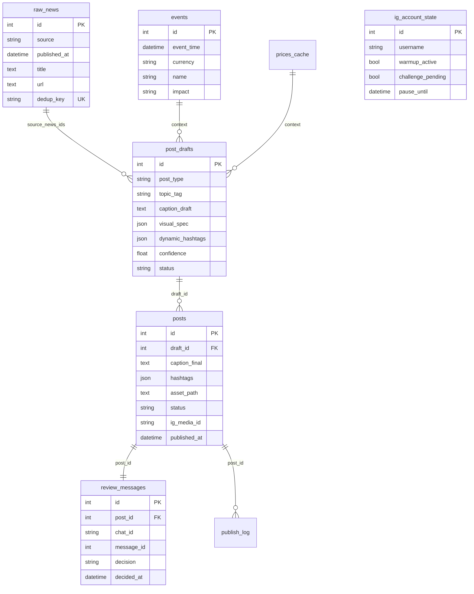
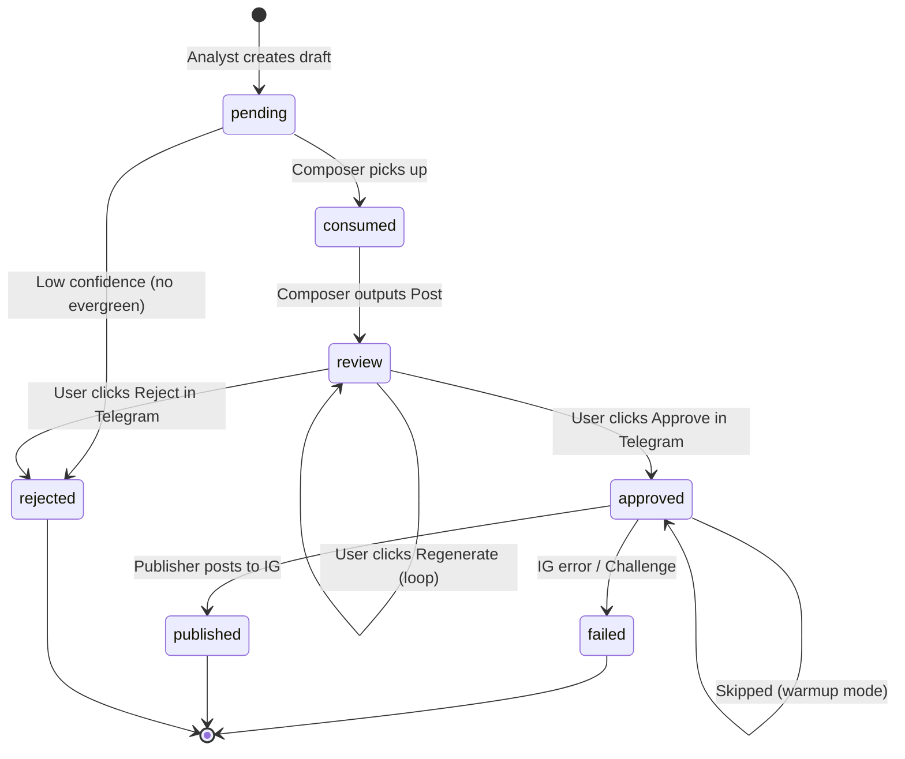
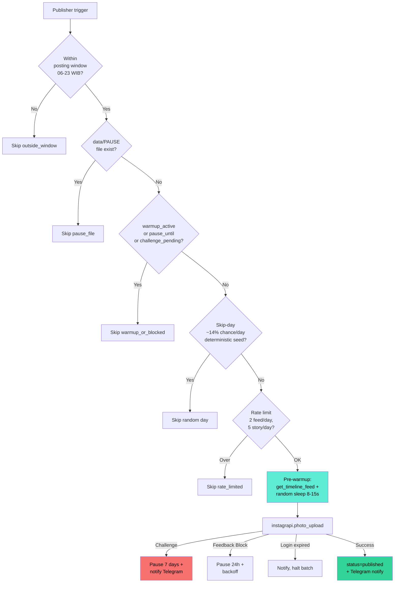
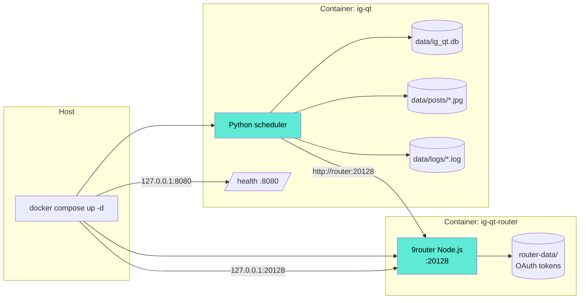

# Architecture — ig-qt

System untuk auto-generate konten Instagram forex/finance edukasi (qtradesedu) — dari fetch berita, generate caption + visual cinematic via AI, sampai review approval workflow di Telegram.

## High-level flow



## Pipeline detail



## Data model



## Post status lifecycle



## LLM provider routing

Semua LLM/Image gen jalan via 9router (`http://localhost:20128/v1`) sebagai single point of routing.

```mermaid
flowchart LR
    subgraph "Application"
        AP[ig-qt]
    end

    subgraph "9router (port 20128)"
        OAI["/v1/chat/completions"]
        IMG["/v1/images/generations"]
    end

    subgraph "Upstream Providers"
        K[Kiro AI<br/>free Claude]
        CFP[Cloudflare<br/>Workers AI]
    end

    AP -->|"text generation<br/>(ranker, composer)"| OAI
    AP -->|"vision review<br/>(critic)"| OAI
    AP -->|"image gen"| IMG

    OAI -->|kr/claude-*| K
    OAI -->|cf/@cf/mistralai/<br/>mistral-small-3.1| CFP
    IMG -->|cf/@cf/black-forest-labs/<br/>flux-1-schnell| CFP
```

**Single API key**: `LLM_API_KEY` di `.env` digunakan untuk semua call. Provider routing diatur di 9router dashboard.

## Anti-bot tactics (publisher)



## Service layout (Docker compose)



## Komponen utama

| Komponen | File | Fungsi |
|---|---|---|
| **Collector** | `collector/pipeline.py` | Orchestrator semua source: NewsAPI, GNews, RSS, Forex Factory, Twelve Data |
| **Analyst Ranker** | `analyst/ranker.py` | Stage 1 LLM: rank 5 kandidat berita berdasarkan impact/recency/diversity |
| **Analyst Angle Gen** | `analyst/angle_generator.py` | Stage 2 LLM: generate caption draft + visual_spec + hashtags |
| **Image Gen** | `composer/image_gen.py` | Cloudflare Flux Schnell via 9router atau direct |
| **Image Critic** | `composer/image_critic.py` | Mistral 3.1 Vision via 9router scoring + tweak hint |
| **Composer** | `composer/runner.py` | Orchestrate hero gen + critic loop + Tailwind HTML render via Playwright |
| **Publisher** | `publisher/runner.py` | instagrapi posting dengan anti-ban tactics |
| **Telegram Reviewer** | `notifier_review.py` | Send + poll review with inline buttons |
| **Scheduler** | `scheduler.py` + `app.py:run_long_running` | APScheduler all jobs |
| **Health Endpoint** | `health.py` | FastAPI `/health` for monitoring |

## Konfigurasi penting

| Setting | Default | Lokasi | Notes |
|---|---|---|---|
| News collection interval | 15 menit | `scheduler.py` | RSS unlimited, NewsAPI 100 req/day = 96 req aman |
| Analyst interval | 30 menit | `scheduler.py` | LLM cost ~$0/day pakai Kiro free tier |
| Composer interval | 10 menit | `scheduler.py` | Pick up pending drafts cepat |
| Publisher interval | 5 menit | `scheduler.py` | Skip kalau warmup mode atau outside window |
| Review send | 2 menit | `scheduler.py` | Telegram-bound |
| Review poll | 20 detik | `scheduler.py` | Telegram callback responsiveness |
| Posting window | 06-23 WIB | `config.yaml` | Jam manusiawi |
| Skip day prob | 14% | `config.yaml` | Anti-bot, 1 hari/minggu |
| Rate limits | 2 feed, 5 story/day | `config.yaml` | Konservatif vs IG soft limit |
| Critic threshold | 0.7 | `composer/runner.py` | Score >= 0.7 = accept |
| Critic max retries | 2 | `composer/runner.py` | Max 3 attempts total |

## Cara development local (tanpa Docker)

```bash
# Terminal 1: 9router
npm install -g 9router
9router

# Terminal 2: ig-qt
uv sync --prerelease=allow
uv run python -m ig_qt --check
uv run python -m ig_qt run
```

Lihat [QUICKSTART.md](QUICKSTART.md) untuk step lebih detail.
