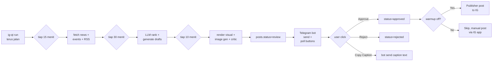

# Quickstart — ig-qt

5 menit setup dari clone sampai post pertama.

## Prerequisites

- Linux/macOS/Windows (PowerShell)
- Python 3.12+ atau Docker
- Akun: NewsAPI, GNews, Twelve Data (free tier semua)
- Akun Telegram + bot token
- Akun Cloudflare (free Workers AI)

## Option A — Docker (recommended for VPS)

```bash
git clone https://github.com/Nabenns/ig-qtrades4241.git
cd ig-qtrades4241
cp .env.example .env
# Edit .env (lihat section Required env vars di bawah)
docker compose build
docker compose up -d
```

Buka http://localhost:20128 (router dashboard) → setup providers (Kiro + Cloudflare).

## Option B — Local development (Windows + uv)

```powershell
# Setup
git clone https://github.com/Nabenns/ig-qtrades4241.git
cd ig-qtrades4241
$env:Path = "$env:APPDATA\Python\Python314\Scripts;$env:Path"   # add uv to PATH
pip install --user uv
uv sync --prerelease=allow

# Configure
cp .env.example .env
notepad .env

# Run 9router separately
npm install -g 9router
9router   # buka http://localhost:20128 → setup providers

# Run ig-qt
uv run python -m ig_qt --check    # validate config
uv run python -m ig_qt run         # all-in-one daemon
```

## Required env vars (`.env`)

```env
LLM_BASE_URL=http://localhost:20128/v1
LLM_API_KEY=<dari 9router dashboard>

IG_USERNAME=<akun ig>
IG_PASSWORD=<password>

NEWSAPI_KEY=<https://newsapi.org/register>
GNEWS_KEY=<https://gnews.io/register>
TWELVEDATA_KEY=<https://twelvedata.com/register>

TELEGRAM_BOT_TOKEN=<via @BotFather>
TELEGRAM_CHAT_ID=<chat ID untuk review notifications>

CF_ACCOUNT_ID=<cloudflare dashboard URL>
CF_API_TOKEN=<workers AI token>
```

## 9router setup (one-time)

1. Buka http://localhost:20128 (default password `123456`)
2. **Providers → Add → Kiro AI** (klik OAuth, pilih Google/GitHub)
3. **Media Providers → Image → Cloudflare**
   - API Key format: `<account_id>:<api_token>`
4. **API Keys → Create** → copy → paste ke `.env` sebagai `LLM_API_KEY`

## Manual commands

| Task | Command |
|---|---|
| Validate setup | `uv run python -m ig_qt --check` |
| Collect berita | `uv run python -m ig_qt collect` |
| Generate drafts | `uv run python -m ig_qt analyze` |
| Render visual | `uv run python -m ig_qt compose` |
| All-in-one daemon | `uv run python -m ig_qt run` |
| Review bot only | `uv run python scripts/run_review_bot.py` |
| Send pending reviews | `uv run python scripts/test_review.py send` |
| Disable warmup | `uv run python -m ig_qt admin warmup-disable` |
| Health check | `curl http://localhost:8080/health` |

## Workflow harian



## File output

```
data/
├── ig_qt.db                    # SQLite database
├── ig_session.json             # IG instagrapi session (auto-generated)
├── posts/
│   └── <id>/
│       ├── hero.png            # AI-generated hero (Cloudflare Flux)
│       ├── hero_attempt_*.png  # All retry attempts (debug)
│       ├── raw.png             # Full HTML render
│       ├── feed.jpg            # Final 1080x1350 (or 1080x1920 story)
│       └── story.jpg
├── logs/
│   ├── app.log                 # Loguru JSON logs (rotate 100MB)
│   └── errors.log              # Errors only (90 days retention)
└── telegram_offset.txt         # Telegram getUpdates offset
```

## Telegram review buttons

Setiap post yang siap review akan kirim foto + caption ke Telegram dengan 4 button:

| Button | Action |
|---|---|
| ✅ Approve | Set `posts.status=approved`. Edit caption: ✅ APPROVED |
| ❌ Reject | Set `posts.status=rejected`. Edit caption: ❌ REJECTED |
| 📋 Copy Caption | Bot kirim full caption sebagai pesan terpisah (tap-hold → copy) |
| 🔄 Regen Image | Reset ke `posts.status=review`. Composer akan regenerate next loop |

## Troubleshooting

### Bot Telegram gak kirim

```powershell
docker compose logs ig-qt | findstr telegram
# Cek TELEGRAM_BOT_TOKEN + TELEGRAM_CHAT_ID
# Test manual: uv run python scripts/test_review.py send
```

### IG login gagal Challenge

Akun baru / IP baru sering trigger anti-bot. Solusi:
1. Pakai workflow hybrid (review di Telegram, post manual via IG app)
2. Atau warmup akun manual via IG app dulu 1-2 minggu

### Image gen gagal

```powershell
# Test direct
uv run python -c "import httpx; r = httpx.post('http://localhost:20128/v1/images/generations', headers={'Authorization': 'Bearer YOUR_KEY'}, json={'model': 'cf/@cf/black-forest-labs/flux-1-schnell', 'prompt': 'a coin'}, timeout=60); print(r.status_code)"
```

Kalau 4xx → cek 9router dashboard, pastikan Cloudflare provider connected.

### Vision critic gagal

Jika model `cf/@cf/mistralai/mistral-small-3.1-24b-instruct` gak available, tweak `image_critic.py` ganti ke model multimodal lain yang support.

## Lihat juga

- [ARCHITECTURE.md](ARCHITECTURE.md) — diagram + flow detail
- [DEPLOY.md](DEPLOY.md) — VPS production deployment
- [SESSION_STATE.md](SESSION_STATE.md) — context recovery snapshot
